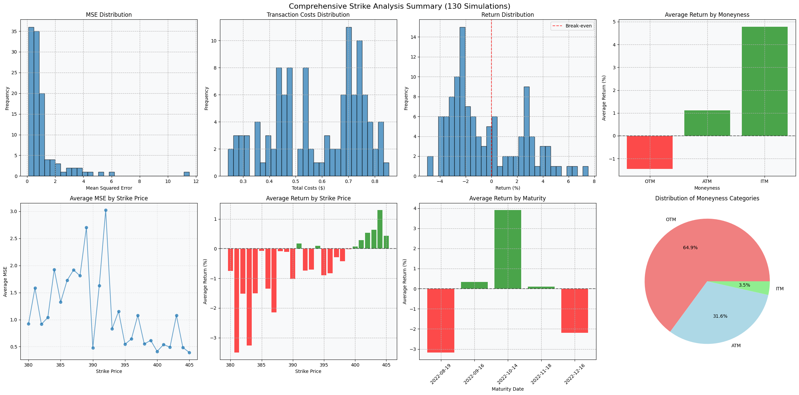
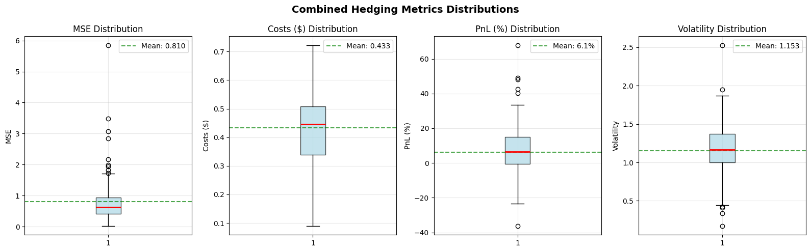
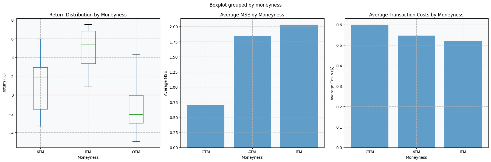

# Options_Hedging_Project

This project implements options hedging strategies for the Financial Risk Management I course at Aalto University. It demonstrates delta hedging, delta-vega hedging, and delta-gamma hedging of call options using real market data, analyzing hedging performance under different rehedging frequencies and market conditions.

## Features
- **Data Fetching**: Automated retrieval of historical option and underlying asset prices using Refinitiv Data Platform
- **Black-Scholes Implementation**: Complete option pricing model with Greeks calculation (delta, vega, gamma)
- **Hedging Simulations**: Dynamic portfolio rebalancing with configurable rehedging intervals
- **Performance Analysis**: Mean squared error calculations and statistical analysis of hedging effectiveness
- **Synthetic Data Templates**: Fallback implementations for testing without live data access

## Technologies
- Python 3.x
- Refinitiv Data Platform (Eikon)
- Jupyter Notebooks
- Pandas, NumPy, SciPy
- Matplotlib for visualization

The project evaluates how different hedging strategies and parameters affect risk management effectiveness in options portfolios.

