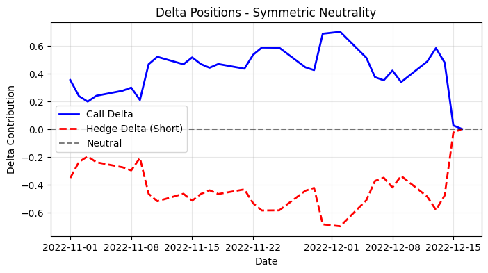

# Options Hedging Project

This project implements comprehensive options hedging strategies, demonstrating delta hedging, delta-vega hedging, and delta-gamma hedging of call options using real market data. It analyzes hedging performance under various rehedging frequencies and market conditions, providing quantitative insights into risk management effectiveness.

## Analysis Results

### Hedging Statistics


### Hedging Metrics Distributions


### Portfolio Value and PnL


### Delta Positions


## Key Findings

The analysis conducted 157 simulations over 45-day intervals with daily rehedging to evaluate hedging strategy effectiveness. The project examines how different hedging strategies and parameters affect risk management effectiveness in options portfolios. Analysis includes performance metrics such as mean squared error, hedging efficiency ratios, and statistical distributions of hedging outcomes across various market conditions.

## Features
- **Data Fetching**: Automated retrieval of historical option and underlying asset prices using Refinitiv Data Platform
- **Black-Scholes Implementation**: Complete option pricing model with Greeks calculation (delta, vega, gamma)
- **Hedging Simulations**: Dynamic portfolio rebalancing with configurable rehedging intervals
- **Performance Analysis**: Mean squared error calculations and statistical analysis of hedging effectiveness
- **Synthetic Data Templates**: Fallback implementations for testing without live data access

## Technologies
- Python 3.x
- Refinitiv Data Platform (Eikon)
- Jupyter Notebooks
- Pandas, NumPy, SciPy
- Matplotlib for visualization

## Installation

1. Clone the repository:
   ```bash
   git clone https://github.com/MariusBoda/Options_Hedging_Project.git
   cd Options_Hedging_Project
   ```

2. Install required dependencies:
   ```bash
   pip install -r requirements.txt
   ```

3. Set up Refinitiv Data Platform credentials (optional, synthetic data available for testing)

## Usage

Run the main analysis in Jupyter Notebook:
```bash
jupyter notebook demo.ipynb
```

The project includes modular components in the `options_lib/` directory:
- `bs.py`: Black-Scholes model implementation
- `data.py`: Data fetching and processing
- `hedging.py`: Hedging strategy implementations
- `plots.py`: Visualization utilities

## Project Structure

```
Options_Hedging_Project/
├── options_lib/           # Core library modules
│   ├── bs.py             # Black-Scholes calculations
│   ├── data.py           # Data handling
│   ├── hedging.py        # Hedging algorithms
│   └── plots.py          # Plotting functions
├── plots/                # Generated visualizations
├── demo.ipynb            # Main analysis notebook
└── README.md             # Project documentation
```
